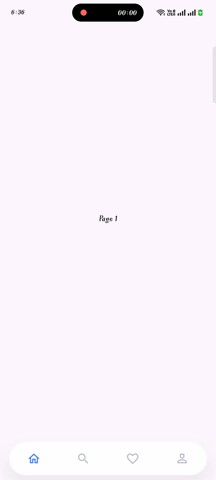
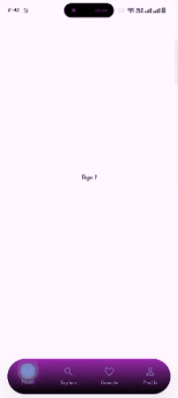
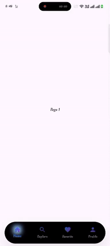
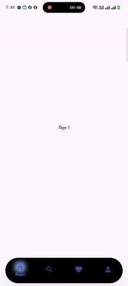

# ElysianNav 🌌✨

A beautiful, highly customizable bottom navigation bar for Flutter with gradient support, glow effects, and smooth animations. Designed for modern apps with responsive scaling and user-friendly customization.

[](https://pub.dev/packages/elysian_nav)
[](https://opensource.org/licenses/MIT)


✨ Features
• 🎨 Gradient Icons – Stunning gradient effects on icons
• 🌟 Glow Effect – Elegant glow on active items
• 🖌️ Gradient Background – Smooth gradient backgrounds
• 📱 Responsive – Built with flutter_screenutil for perfect scaling
• ⚡ Smooth Animations – Fluid transitions between states
• 🎯 Highly Customizable – Control every aspect of appearance
• 📏 Auto Height – Adjusts height automatically based on labels
• 🔤 Selected Label Only – Option to show only selected label


## 📸 Preview

|  |  |  |
|----------------------------|----------------------------|----------------------------|
|  |  |  |


### Installation

Add this to your `pubspec.yaml`:

```yaml
dependencies:
  elysian_nav: ^1.0.2   # Check latest version on pub.dev
  flutter_screenutil: ^5.9.0   
```

```bash
flutter pub get
```

### How to use it

```dart
import 'package:flutter/material.dart';
import 'package:elysian_nav/elysian_nav.dart';

class MyHomePage extends StatefulWidget {
  const MyHomePage({super.key});

  @override
  State<MyHomePage> createState() => _MyHomePageState();
}

class _MyHomePageState extends State<MyHomePage> {
  int _selectedIndex = 0;

  @override
  Widget build(BuildContext context) {
    return Scaffold(
      body: Center(child: Text('Page $_selectedIndex')),
      bottomNavigationBar: ElysianNav(
        currentIndex: _selectedIndex,
        onTap: (index) => setState(() => _selectedIndex = index),
        items: [
          ElysianNavItem(icon: const Icon(Icons.home_outlined), label: 'Home'),
          ElysianNavItem(icon: const Icon(Icons.search_outlined), label: 'Search'),
          ElysianNavItem(icon: const Icon(Icons.favorite_border), label: 'Favorites'),
        ],
      ),
    );
  }
}
```

### 1.Basic Usage (Icons Only)

```dart
ElysianNav(
  currentIndex: _selectedIndex,
  onTap: (index) => setState(() => _selectedIndex = index),
  items: [
    ElysianNavItem(icon: Icon(Icons.home)),
    ElysianNavItem(icon: Icon(Icons.search)),
    ElysianNavItem(icon: Icon(Icons.person)),
  ],
)
```

### 2.Icon + Label

```dart
ElysianNav(
  currentIndex: _selectedIndex,
  onTap: (index) => setState(() => _selectedIndex = index),
  items: [
    ElysianNavItem(icon: Icon(Icons.home), label: 'Home'),
    ElysianNavItem(icon: Icon(Icons.search), label: 'Search'),
  ],
)
```


### 3.Gradient Icons

```dart
ElysianNavItem(
  icon: ElysianNav.celestialIcon(
    icon: Icon(Icons.home),
    colors: [Colors.blue, Colors.purple],
  ),
  label: 'Home',
)
```


### 4.Gradient Background

```dart
ElysianNav(
  backgroundGradient: LinearGradient(
    colors: [Color(0xFFE0F7FA), Color(0xFFFFFFFF)],
    begin: Alignment.topLeft,
    end: Alignment.bottomRight,
  ),
  items: [...]
)
```

### 5.Glow Effect

```dart
ElysianNav(
  enableGlowOnActive: true,
  glowColor: Colors.blue.withOpacity(0.5),
  items: [...]
)
```


### 6.Show Only Selected Label

```dart
ElysianNav(
  showSelectedLabelOnly: true,
  items: [
    ElysianNavItem(icon: Icon(Icons.home), label: 'Home'),
    ElysianNavItem(icon: Icon(Icons.search), label: 'Search'),
  ],
)
```


## ⚙️ ElysianNav Properties

| Property               | Type                  | Default        | Description                          |
|------------------------|-----------------------|----------------|--------------------------------------|
| `currentIndex`         | `int`                 | **required**   | Currently selected index             |
| `items`                | `List<ElysianNavItem>`| **required**   | List of navigation items             |
| `onTap`                | `ValueChanged<int>?`  | `null`         | Callback when item is tapped         |
| `height`               | `double?`             | Auto (56/72)   | Custom height                        |
| `borderRadius`         | `double?`             | Auto           | Rounded corners                      |
| `padding`              | `EdgeInsets?`         | `16h, 8v`      | Padding around nav bar               |
| `backgroundColor`      | `Color?`              | White          | Background color                     |
| `backgroundGradient`   | `LinearGradient?`     | `null`         | Gradient background                  |
| `boxShadow`            | `List<BoxShadow>?`    | Default shadow | Custom shadow                        |
| `iconSize`             | `double?`             | 24             | Icon size (recommended 24–32dp)      |
| `enableGlowOnActive`   | `bool`                | false          | Glow effect on active item           |
| `glowColor`            | `Color?`              | Blue           | Glow color                           |
| `selectedItemColor`    | `Color?`              | #3B82F6      | Selected icon color                  |
| `unselectedItemColor`  | `Color?`              | #98A2B3      | Unselected icon color                |
| `selectedLabelStyle`   | `TextStyle?`          | Default        | Style for selected label             |
| `unselectedLabelStyle` | `TextStyle?`          | Default        | Style for unselected label           |
| `showSelectedLabelOnly`| `bool`                | true           | Show only selected label             |


## 🔹 ElysianNavItem Properties

| Property          | Type      | Default   | Description                    |
|-------------------|-----------|-----------|--------------------------------|
| `icon`            | `Widget`  | required  | Icon to display                |
| `activeIcon`      | `Widget?` | `null`    | Icon when item is active       |
| `label`           | `String?` | `null`    | Label text (optional)          |
| `tooltip`         | `String?` | `null`    | Tooltip text                   |
| `backgroundColor` | `Color?`  | `null`    | Background color for this item |


🔹 Gradient Icon Helper
ElysianNav.celestialIcon(
  icon: Icon(Icons.home),
  colors: [Colors.blue, Colors.purple],
  begin: Alignment.topLeft,
  end: Alignment.bottomRight,
)

📐 Responsive Design
Initialize ScreenUtil in your app:
ScreenUtilInit(
  designSize: Size(375, 812),
  builder: (context, child) => MaterialApp(home: HomePage()),
);


🎨 Best Practices
• Use outlined icons for inactive, filled for active
• Keep gradients subtle (2–3 colors)
• Glow opacity between 0.3–0.5 for elegance
• Icon size between 24–32dp for touch targets
• Labels short (1–2 words)
• Ensure contrast between background & icons

📦 Requirements
• Flutter: >=3.0.0
• Dart: >=3.0.0
• flutter_screenutil: ^5.9.

🙌 Support
If you like this package, give it a ⭐️ on GitHub (github.com in Bing)!